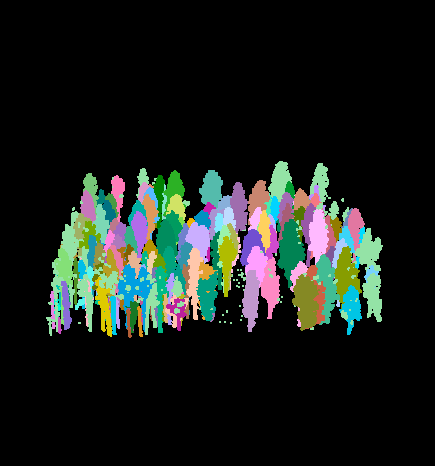

# spanner 
 
[](https://cran.r-project.org/package=spanner)
[](https://doi.org/10.5281/zenodo.4624277)

Definition of spanner
<br/>1 (chiefly British): WRENCH
<br/>2: a wrench that has a hole, projection, or hook at one or both ends of the head for engaging with a corresponding device on the object that is to be turned
<br/>3: utilities to support landscape-, forest-, and tree-related data collection, manipulation, analysis, modelling, and visualization. 

# Install `spanner`

Get the latest released version od spanner from github. Also, spanner requires TreeLS, which isn't currently on CRAN, so you'll need to get that first...

```r
remotes::install_github('tiagodc/TreeLS')
remotes::install_github('bi0m3trics/spanner')
```

# Example usage



The following is the full processing pipeline described in <a href="https://doi.org/10.3390/rs13122297">Donager et al. (2021)</a>, and provides an example from downloading an example dataset, preprocesing it using lidR's functionality, estimating tree locations and DBH by rasterizing individual point cloud values of relative neighborhood density (at 0.3 and 1 m radius) and verticality within a slice of the normalized point cloud around breast height to 
(1.34 m), to individual tree segmentation following ecological principles for “growing” trees based on input locations in a graph-theory approach inspired by work of Tao and others (2015).<br/><br/>

Citation: Donager, Jonathon J., Andrew J. Sánchez Meador, and Ryan C. Blackburn 2021. Adjudicating Perspectives on Forest Structure: How Do Airborne, Terrestrial, and Mobile Lidar-Derived Estimates Compare? Remote Sensing 13, no. 12: 2297. https://doi.org/10.3390/rs13122297

```r
library(spanner)

# set the number of threads to use in lidR
set_lidr_threads(8)

# download and read an example laz
getExampleData("DensePatchA")
LASfile = system.file("extdata", "DensePatchA.laz", package="spanner")
las = readTLSLAS(LASfile, select = "xyzcr", "-filter_with_voxel 0.01")
# Don't forget to make sure the las object has a projection
# projection(las) = sp::CRS("+init=epsg:26912")

# pre-process the example lidar dataset by classifying the ground points
# using lidR::csf(), normalizing it, and removing outlier points 
# using lidR::ivf()
las = classify_ground(las, csf(sloop_smooth = FALSE, 
                                class_threshold = 0.5,
                                cloth_resolution = 0.5, rigidness = 1L, 
                                iterations = 500L, time_step = 0.65))
las = normalize_height(las, tin())
las = classify_noise(las, ivf(0.25, 3))
las = filter_poi(las, Classification != LASNOISE)

# plot the non-ground points, colored by height
plot(filter_poi(las, Classification!=2), color="Z", trim=30)

# perform a deep inspection of the las object. If you see any 
# red text, you may have issues!
las_check(las)

# find individual tree locations and attribute data
myTreeLocs = get_raster_eigen_treelocs(las = las, res = 0.05, 
                                       pt_spacing = 0.0254, 
                                       dens_threshold = 0.2, 
                                       neigh_sizes=c(0.333, 0.166, 0.5), 
                                       eigen_threshold = 0.5, 
                                       grid_slice_min = 0.6666, 
                                       grid_slice_max = 2.0,
                                       minimum_polygon_area = 0.025, 
                                       cylinder_fit_type = "ransac", 
                                       output_location = getwd(), 
                                       max_dia=0.5, 
                                       SDvert = 0.25)

# plot the tree information over a CHM
plot(lidR::grid_canopy(las, res = 0.2, p2r()))
points(myTreeLocs$X, myTreeLocs$Y, col = "black", pch=16, 
       cex = myTreeLocs$Radius^2*10, asp=1)

# segment the point cloud 
myTreeGraph = segment_graph(las = las, tree.locations = myTreeLocs, k = 50, 
                             distance.threshold = 0.5,
                             use.metabolic.scale = FALSE, 
                             subsample.graph = 0.1, 
                             return.dense = FALSE,
                             output_location = getwd())

# plot it in 3d colored by treeID
plot(myTreeGraph, color = "treeID")
```
