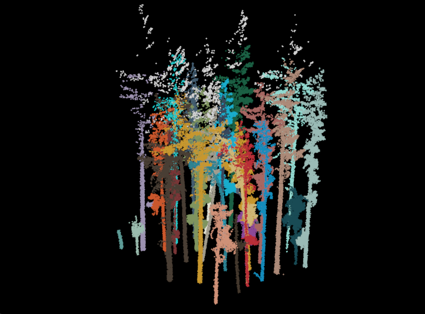
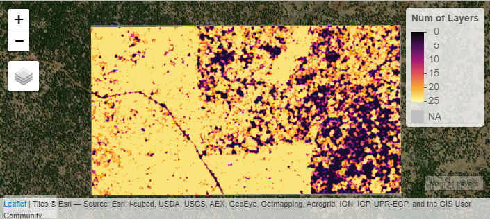

# spanner 
 
[](https://cran.r-project.org/package=spanner)
[](https://doi.org/10.5281/zenodo.4624277)

Definition of spanner
<br/>1 (chiefly British): WRENCH
<br/>2: a wrench that has a hole, projection, or hook at one or both ends of the head for engaging with a corresponding device on the object that is to be turned
<br/>3: utilities to support landscape-, forest-, and tree-related data collection, manipulation, analysis, modelling, and visualization. 


# Install `spanner`

Get the latest released version of spanner from github.

```r
remotes::install_github('bi0m3trics/spanner')
```

# Workflows
## Terrestial Lidar Tree Attributes and Segmentation



The following is the full processing pipeline described in <a href="https://doi.org/10.3390/rs13122297">Donager et al. (2021)</a>, and provides an example from downloading an example dataset, preprocesing it using lidR's functionality, estimating tree locations and DBH by rasterizing individual point cloud values of relative neighborhood density (at 0.3 and 1 m radius) and verticality within a slice of the normalized point cloud around breast height to 
(1.37 m), to individual tree segmentation following ecological principles for “growing” trees based on input locations in a graph-theory approach. Relies heavily on work of <a href = "https://www.sciencedirect.com/science/article/pii/S0034425720304314">Roussel et al (2020)</a>, <a href="https://www.sciencedirect.com/science/article/abs/pii/S0924271615002373?via%3Dihub">Tao and others (2015)</a>, and <a href="https://www.sciencedirect.com/science/article/abs/pii/S0168169917301114?via%3Dihub">de Conto et al. (2017)</a>.<br/><br/>

Citation: Donager, Jonathon J., Andrew J. Sánchez Meador, and Ryan C. Blackburn 2021. Adjudicating Perspectives on Forest Structure: How Do Airborne, Terrestrial, and Mobile Lidar-Derived Estimates Compare? Remote Sensing 13, no. 12: 2297. https://doi.org/10.3390/rs13122297

## PatchMorph: Patch Delineation Algorithm



The patchwoRk function implements a patch delineation algorithm [at present it only implements <a href="https://link.springer.com/article/10.1007/s10980-007-9104-8">'PatchMorph' (Girvetz & Greco 2007)</a>, which can delineate patches across a range of spatial scales based on three organism-specific thresholds - (1) land cover density threshold, (2) habitat gap maximum thickness (gap threshold), and (3) habitat patch minimum thickness (spur threshold)].

Citation: Girvetz EH, and Greco SE. 2007. How to define a patch: a spatial model for hierarchically delineating organism-specific habitat patches. Landscape Ecology 22: 1131-1142. http://dx.doi.org/10.1007/s10980-007-9104-8
