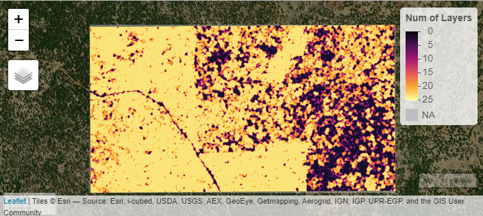

# spanner 

[](https://cran.r-project.org/package=spanner)  [](https://doi.org/10.32614/CRAN.package.spanner) [](https://doi.org/10.5281/zenodo.4624277) 

Definition of spanner <br/>1 (chiefly British): WRENCH <br/>2: a wrench that has a hole, projection, or hook at one or both ends of the head for engaging with a corresponding device on the object that is to be turned <br/>3: implements algorithms for terrestrial, mobile, and airborne lidar processing, tree detection, segmentation, and attribute estimation (Donager et al., 2021), and hierarchical patch delineation (Girvetz & Greco, 2007).


# Install `spanner`

Get the latest development version of spanner from GitHub.

``` r
remotes::install_github("bi0m3trics/spanner")
```

# Workflows

## TLS/MLS Tree Attributes and Segmentation


`spanner` implements algorithms for terrestrial and mobile lidar tree detection, stem classification, stem fitting, tree segmentation, and inventory construction. Version 2.0 adds an explicit staged workflow:

``` r
find_trees() -> tree_points() -> stem_points() -> stem_segments() -> tree_inventory()
```

Each stage accepts a method object, so detection, point assignment, stem classification, and stem fitting can be changed without rewriting the rest of the workflow.

- `find_trees()` detects tree seed locations with `use_raster_eigen()` or `use_hough()`.
- `tree_points()` assigns lidar points to trees with `assign_voronoi()`, `assign_crop()`, or `assign_graph()`.
- `stem_points()` labels stem points with `stem_eigen()` or `stem_hough()`.
- `stem_segments()` fits per-height-slice stem geometry with `seg_ransac_cylinder()`, `seg_irls_cylinder()`, or `seg_bf_cylinder()`.
- `tree_inventory()` rolls tree locations, segmented point clouds, stem segments, volumes, and quality checks into a tree-level `sf` inventory.

This workflow builds on the tree detection and graph segmentation approach described in [Donager et al. (2021)](https://doi.org/10.3390/rs13122297), with supporting ideas from [Roussel et al. (2020)](https://doi.org/10.1016/j.rse.2020.112061), [Tao et al. (2015)](https://doi.org/10.1016/j.isprsjprs.2015.10.007), and [de Conto et al. (2017)](https://doi.org/10.1016/j.compag.2017.10.019).

Citation: Donager, Jonathon J., Andrew J. Sanchez Meador, and Ryan C. Blackburn. 2021. Adjudicating Perspectives on Forest Structure: How Do Airborne, Terrestrial, and Mobile Lidar-Derived Estimates Compare? Remote Sensing 13, no. 12: 2297. <https://doi.org/10.3390/rs13122297>

## MLS Example Using Package Data

The example below runs the five-stage TLS/MLS workflow on `MLS_Clip.laz` from `inst/extdata`. It uses Hough-based methods for detection and stem labelling, which are useful defaults for mobile lidar where point density and occlusion can vary strongly.

``` r
library(spanner)
library(lidR)
library(sf)

mls_file <- system.file("extdata", "MLS_Clip.laz", package = "spanner")
las <- lidR::readLAS(mls_file, select = "xyzcr")
if (lidR::is.empty(las)) stop("MLS_Clip.laz could not be read.")

# The example data are distributed with the package. Set the CRS explicitly
# when needed so downstream sf/terra outputs carry spatial reference metadata.
sf::st_crs(las) <- 26912

# Stage 1: detect tree seed locations.
tree_map <- find_trees(
  las,
  method = use_hough(
    min_h = 1.0,
    max_h = 3.0,
    h_step = 0.5,
    max_d = 0.8,
    min_density = 0.05,
    min_votes = 3L
  )
)

# Stage 2: assign points to detected trees.
las_tree <- tree_points(
  las,
  tree_map,
  method = assign_voronoi(max_dist = 6)
)

# Stage 3: label likely stem points.
las_stem <- stem_points(
  las_tree,
  tree_map,
  method = stem_hough(
    h_base_lo = 1.0,
    h_base_hi = 2.5,
    h_step = 0.5,
    max_d = 0.8,
    min_density = 0.05,
    min_votes = 3L
  )
)

# Stage 4: fit stem cylinders by height slice.
stem_seg <- stem_segments(
  las_stem,
  tree_map,
  method = seg_ransac_cylinder(
    dz = 0.5,
    overlap = 0.1,
    max_radius = 0.8,
    min_pts = 10L
  )
)

# Optional rollups used by quality assessment and inventory output.
stem_vol <- compute_stem_volume(stem_seg, method = "cylinder")
stem_quality <- assess_tree_quality(
  tree_map,
  stem_seg,
  vol_table = stem_vol,
  expected_stem_height = 3.0
)

# Stage 5: create the tree inventory.
inventory <- tree_inventory(
  tree_map,
  las_tree,
  seg_table = stem_seg,
  vol_table = stem_vol,
  qual_table = stem_quality
)

inventory
table(stem_quality$quality_class)
```

Common substitutions:

- Use `use_raster_eigen()` in `find_trees()` for clean, dense TLS scans where DBH precision is more important than speed.
- Use `assign_graph()` in `tree_points()` for crown-aware tree segmentation.
- Use `stem_eigen()` in `stem_points()` when local eigenstructure separates stems from branches reliably.
- Use `seg_irls_cylinder()` for cleaner stems or `seg_bf_cylinder()` for difficult leaning or occluded stems.

## PatchMorph: Patch Delineation Algorithm



`process_rasters_patchmorph()` implements PatchMorph (Girvetz & Greco 2007), a hierarchical patch delineation algorithm that can delineate habitat patches across spatial scales using land-cover density, habitat gap maximum thickness, and habitat patch minimum thickness thresholds.

Citation: Girvetz EH, and Greco SE. 2007. How to define a patch: a spatial model for hierarchically delineating organism-specific habitat patches. Landscape Ecology 22: 1131-1142. <http://dx.doi.org/10.1007/s10980-007-9104-8>

## Allometric Airborne Lidar ITS Algorithms

The package includes three `lidR::segment_trees()`-compatible point-cloud tree segmentation algorithms for normalized ALS data:

- `allometric_li_geodesic()`: Li-style top-down segmentation with allometric crown envelopes and a local geodesic graph.
- `allometric_random_walker()`: seeded diffusion-based segmentation with sparse local-candidate scoring.
- `allometric_supervoxel_segment()`: supervoxel graph segmentation with backfilling and small-island cleanup to reduce unclassified crown speckles.

## Canopy and Woody-Structure Helpers

Recent additions include:

- `compute_lai()`: rasterized LAI/LAD estimation from normalized point clouds.
- `compute_pad_voxels()`: voxelized PAD and pulse-accounting table construction.
- `compute_transmittance_raster()`: Beer-Lambert canopy transmittance raster from PAD voxels.
- `branch_metrics()`: branch-candidate scoring from local eigenstructure outputs.
- `classify_lw_points()`: unified leaf/wood classification for stem, branch, and other returns.
- `segment_stem()`: legacy per-tree stem circle fitting retained for backward compatibility.
- `refit_trees()`: targeted stem refit workflow for trees flagged as marginal or bad quality.

These functions are designed to work together in a tree-attribute workflow, from classification and segmentation to quality control and re-fitting.
